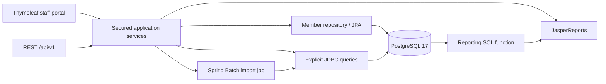
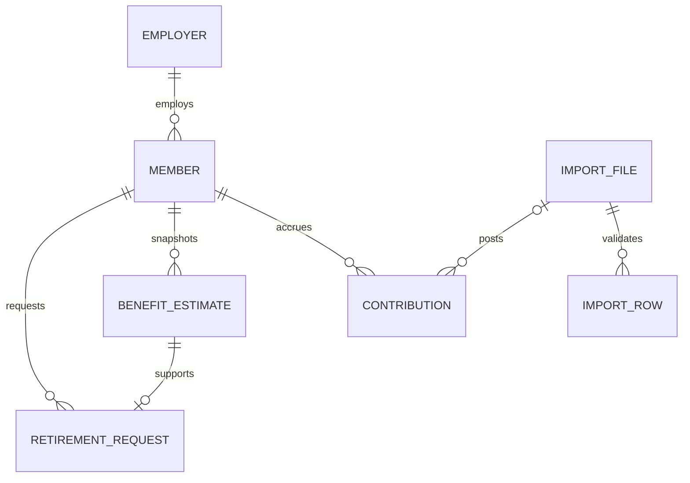
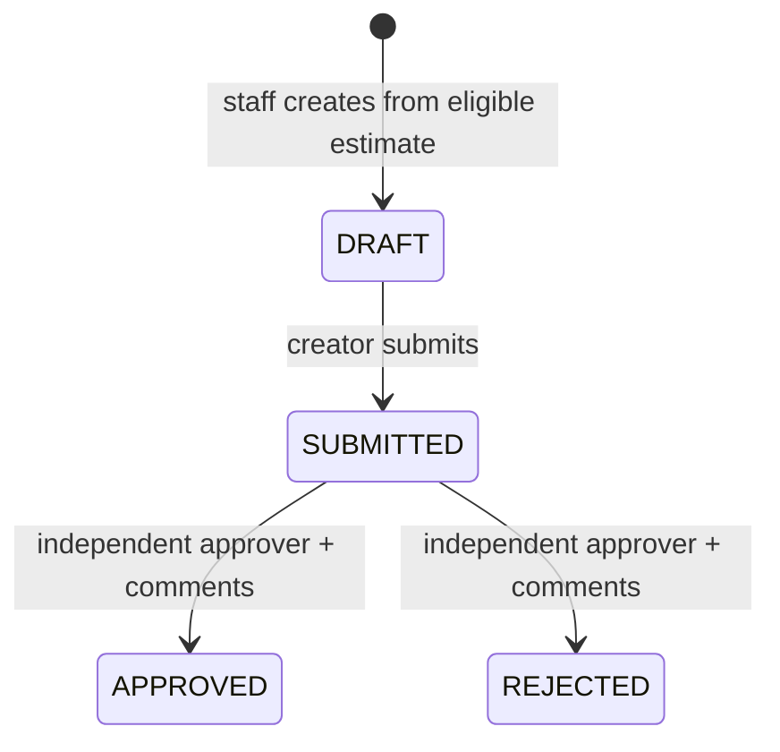

# Architecture and business rules

## One application with clear modules

Both controllers call the same application services. `@PreAuthorize` enforces roles at service boundaries, so a hidden button is never the authorization control. Session authentication and CSRF apply to both HTML and REST. This example intentionally does not add a separate frontend build or microservices.

| Module | Responsibility | Role-description connection |
| --- | --- | --- |
| member | Search and read employer/member records, JPA versioning | Pension data models, Spring |
| contribution | CSV staging, validation, transactional posting, Spring Batch | Integrations, Java batch processing |
| benefit | Pure calculator and immutable estimate snapshots | Financial calculations, unit tests |
| retirement | Draft, submit, independent review, retirement status | Business workflow and enhancements |
| audit | Append-only business event history | Troubleshooting and accountability |
| reporting | JRXML compilation, PostgreSQL reporting function, PDF | Jasper Studio, SQL reporting |
| web/config | REST DTOs, portal, validation, security | REST integration and cloud-ready application structure |

## Relationships

Audit events reference an entity type and ID rather than a polymorphic foreign key. Seed contributions have no import file. Monetary columns use PostgreSQL NUMERIC; Java uses BigDecimal. Dates are calendar dates; audit timestamps are timezone-aware. APIs use numeric IDs; member numbers are stable business identifiers.

## LEARNING-1.0 formula

- As-of date is today or earlier and cannot precede employment. Birthdays use `Period.between`, not a rough day count.
- A distinct posted month through the as-of month contributes one service month. Gaps give no credit. The sample grants the full posted month, even for an as-of date partway through it; this is a fictional simplification.
- At least 36 posted months are required to calculate an amount. Use the latest 36, which need not be consecutive. Average annual pay is their total divided by 3.
- Service years are months divided by 12 using DECIMAL128 precision. Pension factor is `min(serviceYears × 0.02, 0.75)`.
- Annual pension is average annual pay × factor. Monthly pension uses the unrounded annual result divided by 12. Round final currency to two decimals with HALF_UP; don't round fractional service years prematurely.
- Eligibility additionally requires age 55 and at least 120 service months. Ineligible estimates with sufficient salary history show illustrative amounts but cannot become retirement requests.
- Each saved estimate includes birth date, employment start, as-of date, every contributing month/pay input, results, actor, and rule version. A database trigger rejects updates/deletes. Approval uses this immutable estimate; it does not silently recalculate from a changing ledger.

## Import transaction boundaries

1. Validate upload size/encoding, compute SHA-256, and commit an `import_file` plus received audit event. Raw CSV text is retained as the staging input.
2. Run a Spring Batch job identified by import ID. One tasklet processes at most 5,000 rows; it parses the entire bounded input and stores per-record validation results.
3. Lock affected members in ID order and check current status, employment dates, and existing member/month entries. Imports, estimate creation, and retirement approval share the same member lock to serialize conflicting business actions.
4. Any invalid row means **REJECTED** with persisted errors and zero postings. Otherwise, all ledger rows, **POSTED** status, and the posted audit event commit in one transaction. A database or unexpected processing failure rolls that transaction back; a separate transaction records **FAILED**.

Fingerprints make exact replays idempotent. The unique `(member_id, payroll_month)` constraint also prevents double posting when whitespace or decimal formatting changes the fingerprint. Identical uploads return the existing result even if it was rejected. Correct the file before retrying a rejection. Runtime failure/recovery is an operator concern described in the developer guide.

Batch uses the JDBC starter so executions survive application restarts. Metadata creation uses READ_COMMITTED: the fingerprint insert elects one launcher per import, while Batch's unique job key remains a database backstop. This avoids unnecessary PostgreSQL serializable conflicts when different imports launch concurrently. Business posting still uses member locks and ledger uniqueness; metadata isolation is not a substitute for those protections.

## Retirement state machine

There is at most one draft, submitted, or approved request per member. Rejection allows a new request using a new estimate. All transitions compare the submitted `version` with the database version and increment it atomically. Approval and member retirement commit together. The member entity also uses JPA `@Version`. A stale or repeated decision returns 409 without adding a duplicate event. Even a future user holding both roles cannot review their own request.

Audit events commit with the business operation. The database rejects update/delete of events. This protects ordinary application paths; a database owner can still alter schema or disable triggers, so it is not a tamper-proof compliance archive.

## Reporting and deployment boundaries

The report combines an immutable saved estimate with **current** contribution totals obtained from `member_contribution_summary(member_id)`. Its labels distinguish these time bases. The application compiles the editable Jasper 7 JRXML once and fills it per request. There is no external report server.

Flyway owns business schema creation; Hibernate validates it rather than modifying it. Demo seed migration `V100` loads only in the demo profile. Keep future business migrations below V100 in this teaching repository, or renumber the seed migration only when recreating a disposable demo database. Never switch an already seeded demo database into a production environment.
