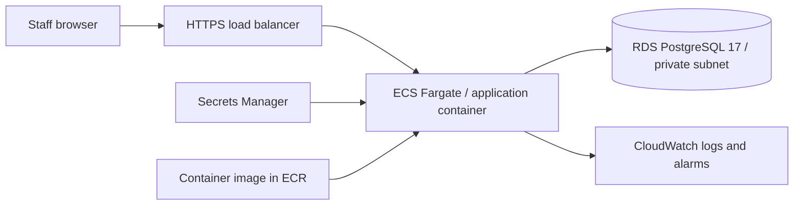

# AWS deployment mapping — guide only

The application runs locally. This guide creates no cloud resources and contains no account credentials or infrastructure templates.

| Local component | AWS counterpart | Deployment considerations |
| --- | --- | --- |
| Application container | ECS Fargate service from ECR | Non-root image; HTTPS ALB; initially one instance for local HTTP sessions |
| PostgreSQL Compose service | RDS PostgreSQL in private subnets | Backups, point-in-time recovery, TLS, security groups, migration permissions |
| DB environment variables | Secrets Manager + ECS task execution role | Least privilege; don't embed passwords in images or source |
| Console logs | CloudWatch Logs | Retention, alarms for import failures, no raw CSV/member data in logs |
| Demo login | Organizational identity provider | Implement before public deployment; never enable demo seed/users |
| JVM sessions | Shared session storage or appropriate routing | Needed before scaling across tasks; not implemented here |

Deployment sequence for a future exercise: implement identity and operational gaps, provision networking/RDS/secrets, run controlled database migrations, build/test an image, push to ECR, create a task definition with secrets and JDBC settings, deploy behind HTTPS, then run non-sensitive health and workflow checks. Use a separate environment and change review for schema releases. The demo profile must remain off.

Imports are deliberately synchronous and small. Larger workloads need durable object storage for files, asynchronous launch, restart/reconciliation controls, and workload isolation. The current code's transactional integrity is useful groundwork, but is not a claim of production readiness or suitability for real financial processing.
