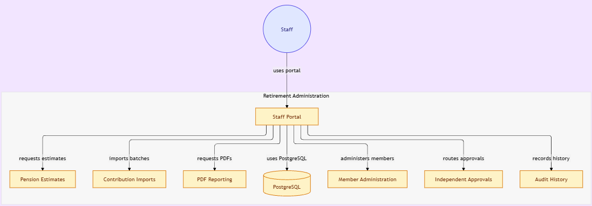

# Saved architecture reference

Saved on 2026-10-05 at your request for later use.

## Repository diagram

The external diagram may change as the repository changes. The attached image below is preserved locally as the reference supplied in this conversation.

## Attached retirement-system diagram

Shows staff using the portal for pension estimates, contribution imports, PDF reporting, PostgreSQL access, member administration, independent approvals, and audit history.
